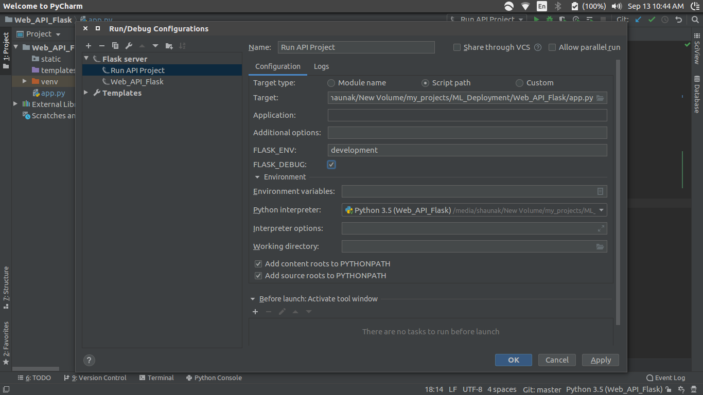
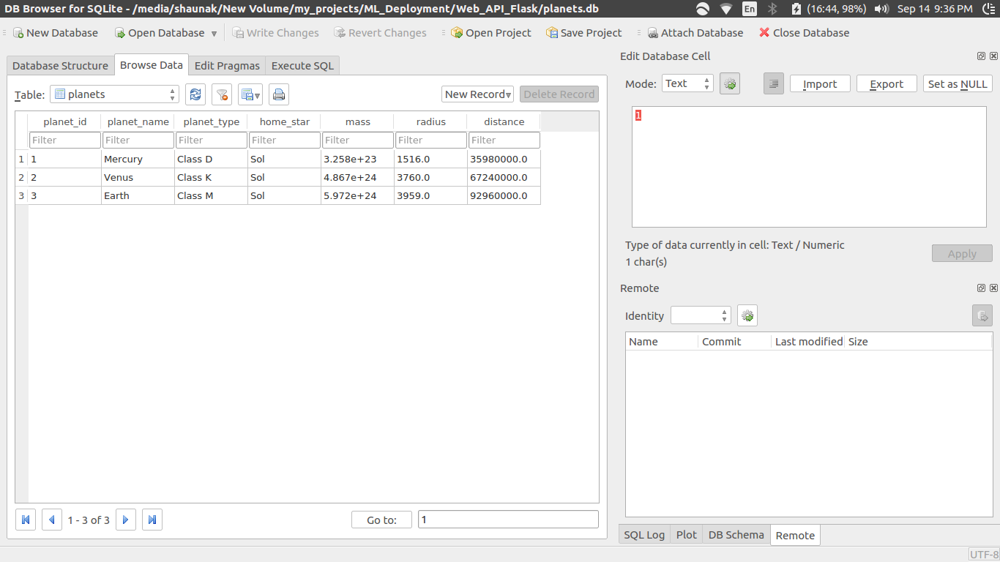

### Run configurations

We can create a new run configuration of type: `Flask Server` 
in pycharm.

While creating we can point the Target to our `app.py` file and
set the `FLASK_DEBUG` environment variable to `True`.  This will 
enable automatic refresh whenever the code is modified



### Install a new package on the venv

To install a new package for the current venv:

1. Go to File -> Settings -> Project -> Project Interpreter
2. Here u can see all packages installed for 


### Flask CLI

In the `app.py` file `@app.cli.command('db_create')` defines 
the function below it as a CLI command `db_create`

Open terminal and type `flask db_create` to run the code 
for that command/function

1. Create the db: `flask db_create`
2. Seed the db: `flask db_seed`

Now we can view the db




### Creating end points for db

We create a new route `/planets` to view all the planets in the 
db. However we run into an error 

```python
@app.route('/planets', methods=['GET'])
def planets():
    planets_list = Planet.query.all()
    return jsonify(data=planets_list)
```

This is because `planets_list` is a list of objects
and we cannot convert them using `jsonify`

The process of converting an obj into a textual repr of that obj
is called **serialization**, and reverse is called **deserialization**

We have to figure out how to serialize a collection of `SQLAlchemy Data Rows`

We use `flask-marshmallow` for this

The steps are"

1. Init marshmallow
```python
# init marshmallow
ma = Marshmallow(app)
```
2. Setup the classes for the fields

```python
class UserSchema(ma.Schema):
    class Meta:
        fields = ('id', 'first_name', 'last_name', 'email', 'password')


class PlanetSchema(ma.Schema):
    class Meta:
        fields = ('planet_id', 'planet_name', 'planet_type', 'home_star', 'mass', 'radius', 'distance')
```

3. Instantiate the classes with single as well as multi obj deserialization
```python
user_schema = UserSchema()
users_schema = UserSchema(many=True)

planet_schema = PlanetSchema()
planets_schema = PlanetSchema(many=True)

```

4. Use in the route
```python
@app.route('/planets', methods=['GET'])
def planets():
    planets_list = Planet.query.all()
    # use marshmallow to deserialize the result set
    result = planets_schema.dump(planets_list)
    # result is fully serialized - we can now use jsonify
    return jsonify(result)
```

